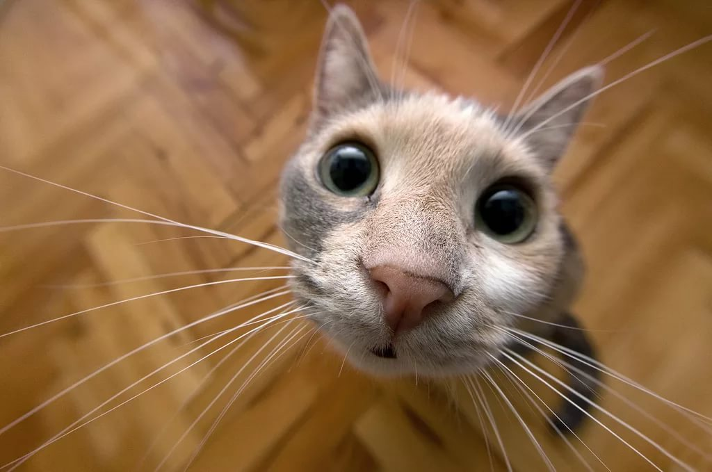

# I love cat!

## Определение
**Кошки** — это _удивительные создания_, которые могут стать прекрасными питомцами и верными друзьями для человека. Если вы хотите завести кошку, убедитесь, что вы _готовы уделять ей достаточно времени и внимания_, чтобы она чувствовала себя счастливой и здоровой.
## Интересные факты о кошках

1. Кошки могут видеть в темноте благодаря наличию специального слоя в глазах, под названием тапетум, который находится за сетчаткой и отражает свет обратно на фоторецепторы, что позволяет кошкам улавливать даже самый слабый свет.
   
2. Хвост кошки является своеобразным рулем при прыжках и помогает балансировать все движения. Также считается, что хвост кошек служит неким вентилятором для терморегуляции температуры тела. Помимо таких функций, кошка с помощью хвоста может передать своё эмоциональное состояние своему хозяину.
   
3. Кошка может менять положение своих ушных раковин на 180°.
   
4. У кошек 30 зубов. Они также обновляются один раз в жизни с молочных на коренные, как и у человека. Для сравнения у взрослого человека нормой считается — 32 зуба, а у собак — 42 зуба.
   
5. Мозг кошки работает настолько эффективно, что они способны запоминать около 50 лиц и голосов. Также кошки могут воспроизводить около 100 различных звуков.
   
   

6. При падении кошка всегда приземляется на лапы. Они имеют очень гибкий позвоночник, который позволяет им легко поворачиваться и изгибаться во время падения.
   
7. В мире существует около 60 пород домашних кошек. Это среднее значение, потому что в разных организациях зарегистрировано разное количество кошек. К примеру, CFA* признала всего — 42 породы кошек, а вот TICA* - 71. В целом насчитывается больше 100 различных пород.
   
8. Усы помогают кошке ориентироваться в пространстве, особенно в темноте. Поэтому нельзя дергать кошек за усы, а тем более подстригать их.
   
9.  Температура тела взрослой кошки составляет 38-39°С. Когда для человека эта температура довольно высокая.
    
10. У кошек более 20 различных мышц отвечают за движение ушей.
    

## Познавательные ссылки
https://youtu.be/0tOXxuLcaog

## Обратная связь

Тел.: 8 978 456 12 78

E-mail: info_cats@mail.ru
